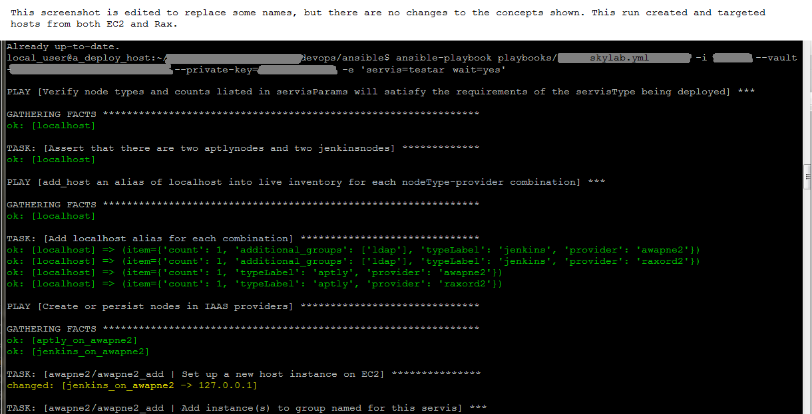
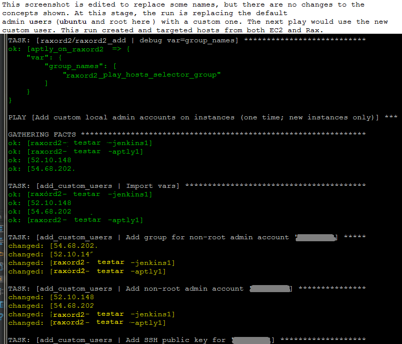

# pansi

### What issue does pansi primarily target?

Ansible's documentation defines patterns for idempotently maintaining set numbers of hosts on IAAS providers such as AWS and Rackspace using attributes or tags to maintain desired counts for each type of host (specifically, the pattern of running a cloud module as a 'local_action:' and then iterating with 'add_host:' to get the cloud hosts into live inventory). However, the natural progression of deploying with this model is to statically write these host tags and counts into the playbook for each type of service that needs to be deployed. Further, if some instances of a service are on different providers or need to run different numbers of each type of host, the playbook for that specific service instance will then itself have multiple versions. Playbook upkeep and task duplication under this approach can become an issue even with a relatively small number of services deployed.

### How does pansi address the issue; are there other options?

The main goal of pansi is to document a pattern in which the variables that define the host-layout of a service can be stored in a variables file and "passed" (by the playbook for the service being deployed) to a set of generalized IAAS roles that will do the actual work with Ansible's cloud modules. Or in other words it is an abstraction designed to separate the playbooks that create and deploy the service from the variables that distinguish it from other services of the same type. Under this approach, each service only needs one playbook to deploy and maintain all instances of itself.

The distinction between pansi and maintaining static inventory is that pansi stores what types of hosts a service requires, how many there are of each type, and what service-specific variables there might be, but knows next to nothing about any individual host (thereby leaving that job to dynamic inventory scripts). This is a critical distinction for the purposes of staying on the 'cattle' side of the traditional pets v. cattle analogy.

Adding separate infrastructure tooling like Terraform to your systems is another solution (and in many cases a better, more full featured longterm option) but adoption can take time and may often get blocked by more immediate tasks. Pansi can be used as a stepping stone here because it has conceptual similarities to these "declarative infrastructure" tools, and because it consists purely of Ansible concepts and processes it is more quickly understood and implemented.

### Secondary issues/benefits

**Moving hosts with the traditional 'add_host:' loop**  
Statically writing the 'local_action:' cloud module tasks into the playbooks that deploy your services (or, slightly better, storing those tasks separately and importing them) makes it cumbersome to move services or parts of services to other providers.

**Moving hosts with pansi**  
Storing the parameters that define a service's layout separately allows for moving a host to another provider by changing a single variable. (Though, whether or not the entire service must be redeployed or host being relocated is simply killed prior to re-running Ansible still depends on what the service does and how it manages its state.)

### What does the name mean?

Deploying named instances of services onto providers is kind of PAAS-like; pansi is an assortment of 
letters from the phrase "PAAS in Ansible" run together.

### Definitions

**NOTE**: The purpose of the odd spellings is to help maintain manageability. For example,
the term below 'servis' is merely a misspelling of 'service'. The misspelled option is
more easily located and distinguished in codebases, which often use these common terms
in many different contexts. Should a term ever need to be renamed or modified procedurally,
the find/replace or other operation will be much easier on the human running it and there
may be 100 instances of the misspelled term to sort through instead of (in some cases)
thousands of unrelated instances in the case of using a generic term spelled correctly.

**host**: An Ansible host.

**servis**: A 'service', or 'deployment'. A servis is a host (or hosts working together)
to do an assigned job such as run builds, host a package cache, store backups, host a
database or web frontend, or etc.

**servisName**, and **servisType**: Each servis has a "servisName" and is an instance of its
 "servisType", just as a traditional named programming object is an instance of its
 declaration. Servis names and types are semi-arbitrary so long as they are consistent in
 the couple of places they are defined in pansi. A servis named 'debby' might be of the
 servisType 'apt-cache', while a servis named 'who' might be of the servisType 'bind9-deploy'.
 The fictitious included example servis 'testar' is an instance of the fictitious servisType
 'skylab', a name which could reflect the logistical/oversight aspects of the work it does.)

**servisParams**: A data structure that stores these other parameters that define a servis,
 which takes the form of an Ansible group_vars file named for the servisName.

**provider**: Hosts are provided by providers. These are Infrastructure as a Service (IAAS)
 providers such as EC2 and Rackspace. Providers' names are semi-arbitrary, as long as they
 match in the couple of places they are defined in pansi. Providers are actually a reference
 to an individual tennant/project/VPC-subnet within an IAAS provider (as opposed to the
 entire IAAS company, or everything a you host there... which would be too broad). Example
 provider names might be 'awapne2' if you had a single VPC in the Asia-Pacific
 Northeast-2 region of AWS or 'raxord2' for the second of two Rackspace accounts that
 deploy into the ORD datacenter in Chicago.

**labeling_group**: A host's "labeling_group" is the primary Ansible group pansi uses to keep
track of the host. The aforementioned example servis 'testar' is primarily tasked with
running Jenkins so the labeling_group is 'jenkins'.

Aside from providing a portion of the host's name in IAAS providers, distinguishing one group
as the labeling_group is mainly intended as a convenience for us humans. However, because the
idempotence of Ansible's cloud modules must depend on a label and the labeling_group is used
for that here, changing the labeling_group requires redeploying the servis unless the value
can be manually updated "out of band" in the IAAS provider's interface (where it may have to
be updated in several places/contexts). Otherwise you'll end up with twice the intended hosts
(one set with the new labeling_group, and one orphaned set set with the old one *which may
still see requests going to the old set and cause a sort of split-brain*).

**roles_applied**: The host will get added to a group named for each item in this list. The
plays in the playbook that apply roles will specify target hosts based on these groups. 

Implementation notes:
**The list of groups a host is a member of will (at a minimum) consist of the union of the
labeling_group and the roles_applied list.** Although this means the labeling_group can be
used as if it were a value in the roles_applied list (regardless of whether it is also
listed there or not - this is a stylistic preference), the labeling_group is given no
special precedence in the deploy order. The order that entries are defined in the
roles_applied list also has no bearing. **The deploy order is determined by the playbook
for the servisType**. Returning to our fictitious included example 'testar': The playbook
deploying a skylab servis needs LDAP running before Jenkins can use it for auth, so the
group and plays for LDAP in the skylab playbook appear earlier than those for Jenkins in
spite of 'jenkins' being those host's labeling_group.

### Is there any other information about pansi that maybe hasn't been completely formatted yet that you could just sort of paste-vomit into this space for me to read?

These values are important to pansi:

- Creating new concepts and terms should be avoided in most cases in favor of recycling existing Ansible (or general 
"cloud-ops") concepts and terminology. For example pansi defines host's Ansible group memberships directly in the
 group_vars files that define the servisParams, rather than creating a "servisRole" or "servisComponentType"
 parameter for what each host's purpose is and then having to map the appropriate set of Ansible groups in a
 servisRole-to-ansibleGroup data structure. Calling them what they are right in the servisParams removes the need
 for this extra layer of indirection.
- As pansi itself will be seen by some as an anti-pattern anyway, it's reasonable to utilize some anti-patterns or
 generally odd methods of accomplishing its goals. **HOWEVER**, finding innovative ways to make pansi's operations
 work more like current established patterns is a high-priority goal.
- The roadmap should always include discussion of options for further removing concepts, terms, and anti-patterns 
that do not have their own application outside of pansi.

This is the current model in brief (and probably with technical omissions or misstatements):

- group_vars files that are understood to be used solely for pansi are created with a structure that defines an 
instance of a service, and any variables specific to that service.
- The name of the service to be deployed is passed on the ansible-playbook command line (-e).
- A localhost play imports the group_vars file using the service name passed on the command line.
- 'add_host:' is used to create an alias of localhost for each combination of: 'IAAS_provider:labeling_group'.
  - host vars that will be used by provider roles are passed along in the add_host task.
- The play calls the provider role(s) once for each alias of localhost.

pansi is currently part of a production deployment and includes some interesting features like replacing the 
default administrative user in the IAAS provider's disk image and switching to the new user both within a single run
of ansible-playbook, as well as deploying services divided arbitrarily across multiple IAAS providers (because of 
how Ansible's cloud modules are used, the provider roles are written specifically for pansi, but they are all 
functionally very similar to one another. EC2, Rackspace, and private OpenStack [the older nova compute module] 
are implemented thus far).

Most if not all of this functionality will be added to this repo as portions of the existing implementation 
are cleaned up and made less specific to their current use case.

### A couple of screen shots

